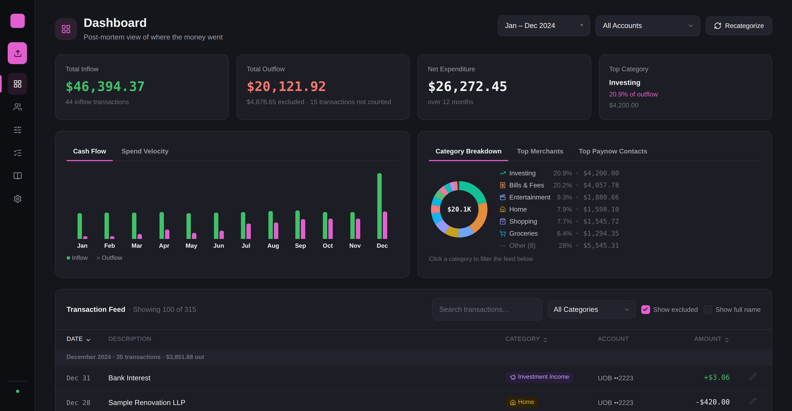
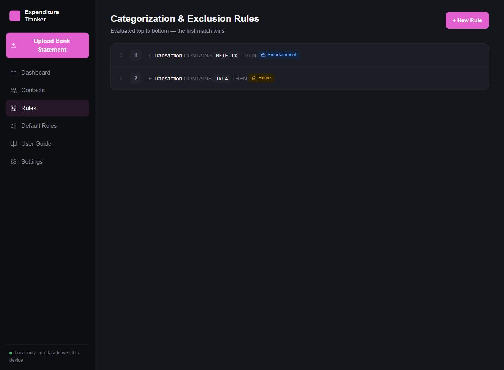
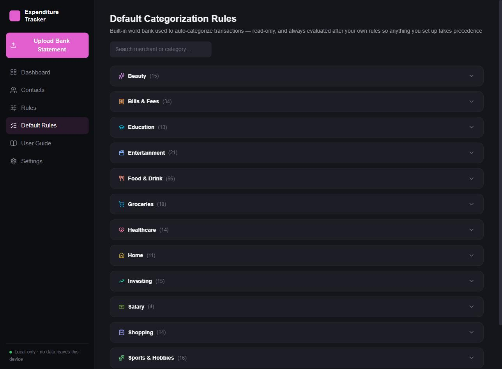
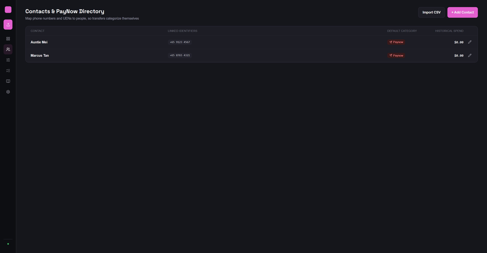

# SG Expenditure Tracker

[](LICENSE)

A local-only personal finance tool for Singapore bank statements. Upload a PDF, get every transaction auto-categorized, refunds automatically netted against their originals, and a post-mortem spending dashboard — without a single byte leaving your machine.



## What it does

- **Upload** UOB account and credit card e-statement PDFs (password-protected ones too) — one at a time or several at once, mixing months and statement types freely. DBS and OCBC are recognized and cleanly reported as "not yet supported" rather than a generic parse error — the per-bank parser registry (`backend/src/app/parsing/`) is built to take them (and other banks) as drop-in additions.
- **Review before committing.** Every parsed transaction is staged first, pre-categorized, with anything ambiguous (like an unmapped PayNow transfer) flagged for a quick manual call.
- **Categorize automatically**, via a priority-ordered rules engine: your own rules first, then a large built-in word bank of common SG merchants, then contact-based PayNow matching. Nothing you do is ever silently overridden — you can always see, and re-run, exactly why a transaction landed where it did.
- **Catch duplicates and refunds.** Re-uploading an overlapping statement is safe — duplicate transactions are detected and skipped. Refunds are paired against their original purchase automatically (merchant-name matching, not just amount-matching, to avoid false positives).
- **Avoid double-counting.** If you upload both a credit card statement and the linked bank account's statement, the GIRO payment settling the card bill is recognized and excluded — the spending is already counted on the card's own statement.
- **Visualize it**: cash flow, category breakdown, spend velocity (this period's pace vs. the last), top merchants, and top PayNow contacts, all filterable by date range and account.
- **Optionally hand the leftovers to AI.** Whatever the rules engine still can't resolve after an upload or a recategorize run — no rule match, no contact match, not a PayNow marker — is sent to an LLM automatically in the background, which suggests a category, a clean display label, and a rule pattern for you to accept or reject. Opt-in and off by default; see [AI-assisted categorization](#ai-assisted-categorization) below.

Everything is stored in a single SQLite file on disk. There's no account system, no server to talk to, and no telemetry by default — see [AI-assisted categorization](#ai-assisted-categorization) for the one opt-in feature that can change that, and [design decisions](#design-decisions) for what the rest of that trade-off actually means in the code.

## Install & Run

Requires [`uv`](https://docs.astral.sh/uv/) (Python 3.12 package/env manager) and Node.js 18+. If you don't have real UOB statements handy, the repo ships sanitized synthetic ones you can try immediately — see below.

### One command (Windows)

```
git clone https://github.com/syoopie/spend-track.git
cd spend-track
scripts\start.bat
```

### One command (macOS / Linux)

```bash
git clone https://github.com/syoopie/spend-track.git
cd spend-track
./scripts/start.sh
```

Either script installs dependencies on first run, launches the backend and frontend, waits for both to come up, and opens your browser. Safe to re-run — it detects servers that are already up and won't start duplicates. Ctrl+C stops whatever it started.

### Manual (any OS)

Two dev servers, run in separate terminals.

**Backend** (from `backend/`):

```bash
uv sync
uv run uvicorn app.main:app --reload
```

Serves the API on `http://127.0.0.1:8000`. The SQLite database defaults to `~/.sg-expenditure-tracker/data.db` (override with the `SG_TRACKER_DB_PATH` env var — handy for pointing a second instance at a scratch database).

**Frontend** (from `frontend/`):

```bash
npm install
npm run dev
```

Serves the UI on `http://localhost:5173` and proxies `/api/*` requests to the backend.

### Trying it without a real statement

Open the app and upload any PDF from `PDF Examples (Sanitized)/UOB/` — six months (Jan–Jun 2024) of synthetic account and card statements for one fictional "SAMPLE CUSTOMER", with realistic-looking transactions across every category. They're generated by `backend/scripts/generate_sample_pdfs.py` at the exact column positions the real parser expects, so they parse through the same code path as a genuine statement — this isn't a mocked demo mode, it's the real thing pointed at fake data.

### Running the tests

```bash
cd backend && uv run pytest
```

Parser regression tests run against every committed sanitized sample PDF, plus full API integration tests via FastAPI's `TestClient` — all pass on a fresh clone with no setup beyond `uv sync`. A handful of additional tests run only if you've dropped your own real UOB statements into a local, gitignored `PDF Examples/UOB/` folder (cross-validated against each statement's own printed totals) — they're skipped, not failed, when that folder doesn't exist. The frontend has no automated test suite yet — verified manually in-browser, with `npx tsc -b` and `npm run build` for type/build checks.

## AI-assisted categorization

Off by default. Turn it on in **Settings → AI** and every future upload or recategorize run automatically sends whatever the rules engine couldn't resolve — no rule match, no contact match, and not a PayNow marker (those keep their existing manual-review path unchanged) — to an LLM in the background. It comes back with a suggested category, a clean merchant label stripped of bank-statement noise, and a candidate rule pattern; nothing is applied silently, it just shows up pre-filled in the staging review screen for you to accept, edit, or reject like any other row. Closing the review dialog doesn't cancel the job — reopen it later and the suggestions are there.

**Three provider options, one shared code path** (`backend/src/app/engine/ai_providers/`):

- **Local (Ollama)** — the default. Points at a model you're already running yourself (`ollama serve`); nothing leaves the device, consistent with the rest of the app.
- **OpenAI-compatible** — one adapter for OpenAI, OpenRouter, Groq, together.ai, a self-hosted LiteLLM proxy, or anything else speaking the same chat-completions API, via a configurable base URL.
- **Anthropic (Claude)** — its own adapter, since the Messages API shape differs enough to warrant one.

Reachability is checked before every real use (app load, viewing the AI settings, and right before each categorization pass) so a down model degrades to a clear warning banner instead of a stuck upload. Choosing anything other than Ollama is a real privacy trade-off — transaction descriptions and amounts leave the device — so the Settings page gates it behind an explicit "I understand transaction data will leave this device" checkbox, and the sidebar's local-only indicator and the in-app Guide both reflect the actual current state rather than always claiming local-only. API keys are write-only through the API (only `sk-…last4` is ever echoed back) and stored in the same local `config.json` the database path already lives in.

## Design Decisions

A few choices in here aren't obvious from reading the code cold, so they're written down.

**Everything local, on purpose.** This isn't "local-first with a cloud option later" — there is no server component beyond the FastAPI process running on your own machine, no auth, no accounts. The trade-off: no multi-device sync, no backup beyond whatever you set up yourself for the SQLite file (`Settings → Change Database Path` at least lets you point it at a synced folder). For a tool that ingests full bank statements, that trade felt like the right default rather than a limitation to work around.

**PDF parsing is whitespace clustering, not table extraction.** UOB's statements have no table gridlines, so the usual "detect table structure" approach in PDF libraries doesn't apply. Instead, words are clustered into physical lines by vertical proximity, then bucketed into columns by hardcoded x-ranges calibrated against real statements. This is more fragile to a genuine layout change from the bank than table detection would be, but it's the only approach that actually works against a gridline-free layout — and it's covered by both real-statement regression tests and the synthetic fixtures, so a future layout change would fail loudly rather than silently misparse.

**Rules beat merchant knowledge beat contacts, in a specific order.** Categorization checks, in sequence: your own rules (by priority), then a card-bill-payment heuristic (see below), then contact-identifier matches, then a large built-in merchant/keyword word bank, then a PayNow-marker fallback that flags for manual review rather than guessing. User rules always win over the built-in bank — they're seeded at a priority number far below any rule you'd realistically create by hand, so there's no scenario where the built-in knowledge silently overrides a choice you made.

**The built-in rule bank is reconciled, not seeded once.** Early on, default rules were inserted once at first startup and never touched again — which meant a rule added to the codebase in a later update would never reach a database that already existed. It's now fully deleted and re-inserted from the source list on every startup, which is what lets the rule bank keep growing over time without a migration script for every addition.

**Card-bill double-counting is a heuristic, gated conservatively.** A transaction that looks like "pay my own credit card bill" is only ever excluded if a credit card account is actually known — either already committed, or parsed earlier in the same multi-file upload. If you've never uploaded a card statement, that GIRO payment is left as real, visible outflow, because for all the app knows, it might be the only record of that money leaving. The alternative (a static text-pattern rule) would either hide real spending for card-less users or require cross-account context a plain rule can't express — so it's a small piece of code in the categorization engine instead of a data-driven rule.

**Refund pairing isn't amount-only.** Naively matching any two transactions of equal-and-opposite amount produces false positives constantly (two unrelated transactions happening to net to zero is common). Pairing also requires merchant-name similarity after stripping suffix noise like "REFUND" or "REVERSAL".

**Staging is in-memory, not a database table.** A batch of parsed-but-not-yet-committed transactions lives in a process-local store, not SQLite. Pre-commit review is inherently transient — you either commit it or you don't — so persisting it durably would add a table, a cleanup story for abandoned batches, and migration surface for a feature that shouldn't outlive the review page anyway. The real trade-off: a batch is lost if the server restarts mid-review. Acceptable for a local, single-user tool; worth knowing if you're wondering why a page refresh mid-review can lose your progress.

**Schema migrations are column-existence checks, not a version-gated migration runner.** `PRAGMA user_version` is bumped for humans reading the schema's history, but nothing branches on its value — every migration function checks whether its own column already exists before adding it, so re-running the full migration set on an up-to-date database is always a safe no-op. Simpler than a real migration framework, and sufficient for a schema that only ever grows additively.

**AI categorization runs as a background job, never inline in the upload request.** A model call can take a while; blocking the upload response on it would mean a slow or unreachable model holds the UI hostage. Instead the upload/recategorize response returns immediately and the AI pass updates an `ai_status` field the frontend polls, so the review screen is usable (and closable) the whole time regardless of how long the model takes or whether it's reachable at all. It's also called with `temperature: 0` — categorization is a classification task, not a creative one, and a live evaluation harness against a local model (`backend/scripts/eval_ai_categorization.py`) showed the default nonzero sampling temperature was a bigger source of wrong answers than the prompt wording itself.

### Stack

- **Backend**: Python 3.12, FastAPI, SQLite (stdlib `sqlite3`, no ORM), `pdfplumber` for PDF parsing, `pypdf` for encrypted-PDF handling, `httpx` for the AI provider calls. Managed with `uv`.
- **Frontend**: React + TypeScript, Vite, Tailwind CSS v4, TanStack Query, React Router. No charting library — every chart is hand-rolled SVG.

### Layout

```text
backend/src/app/
  parsing/       per-bank statement parsers (uob/, dbs/, ocbc/) behind a shared registry
  engine/        categorization rules, fingerprinting/dedup, refund pairing, in-memory staging store
  engine/ai_providers/  pluggable AI categorization: Ollama / OpenAI-compatible / Anthropic adapters
  routers/       FastAPI routes, one file per resource
  repo.py        DB-query helpers shared across routers
  errors.py      shared API error-response construction
  migrations.py  schema DDL migration + default-rule/category reconciliation
frontend/src/
  api/           fetch client + typed React Query hooks
  pages/         one file per screen
  components/    shared UI (charts, modals, sidebar)
docs/            original design docs + screenshots (see below)
scripts/         start.bat / start.sh / start.ps1
```

`docs/technical-spec.md` and `docs/ux-spec.md` are the original design docs written before implementation started — kept for the decisions they capture; where the app has since diverged on purpose, that's documented in `CLAUDE.md` rather than rewritten back into history. `PDF Examples (Sanitized)/UOB/` are the synthetic statements mentioned above — safe to commit, and what a fresh clone actually has to test against. `PDF Examples/UOB/` is an optional local folder (gitignored, never committed) where you can drop your own real UOB statements to test against genuine data.

## A closer look

| Rules — your own categorization logic, evaluated top to bottom | Default Rules — the built-in word bank, read-only |
|---|---|
|  |  |

**Contacts** map a PayNow identifier (phone, UEN, or account number) to a name and default category, so transfers to people you pay regularly categorize themselves instead of sitting in "needs review":


