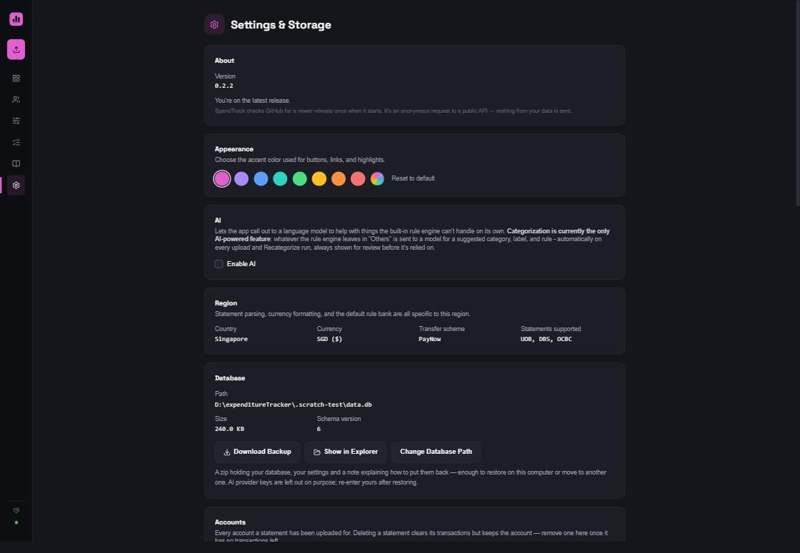
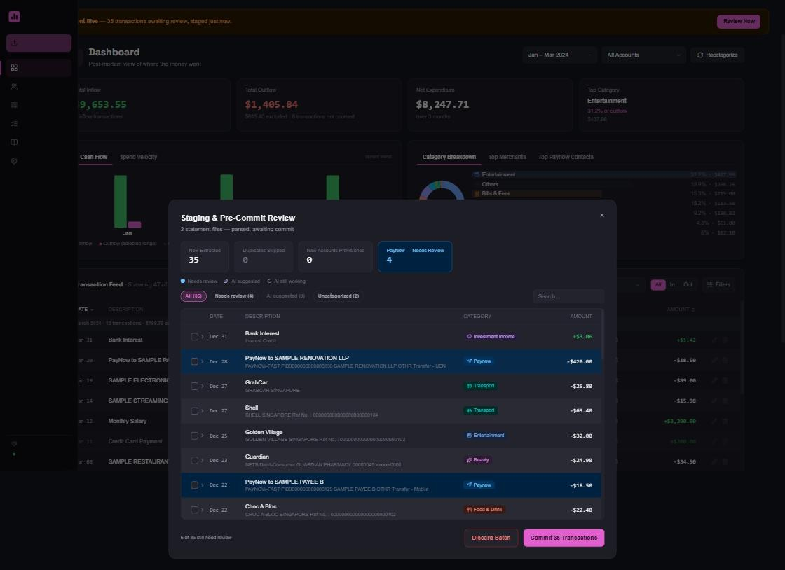
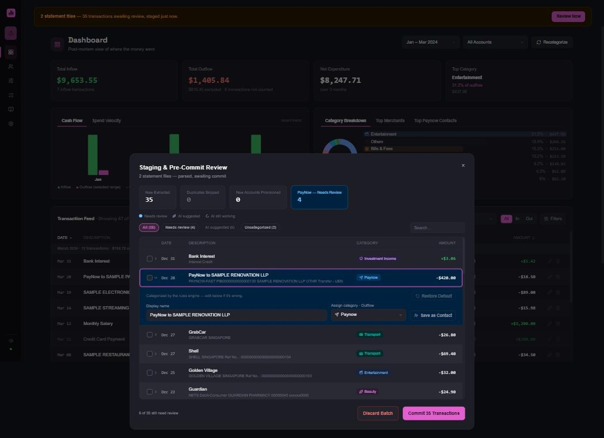
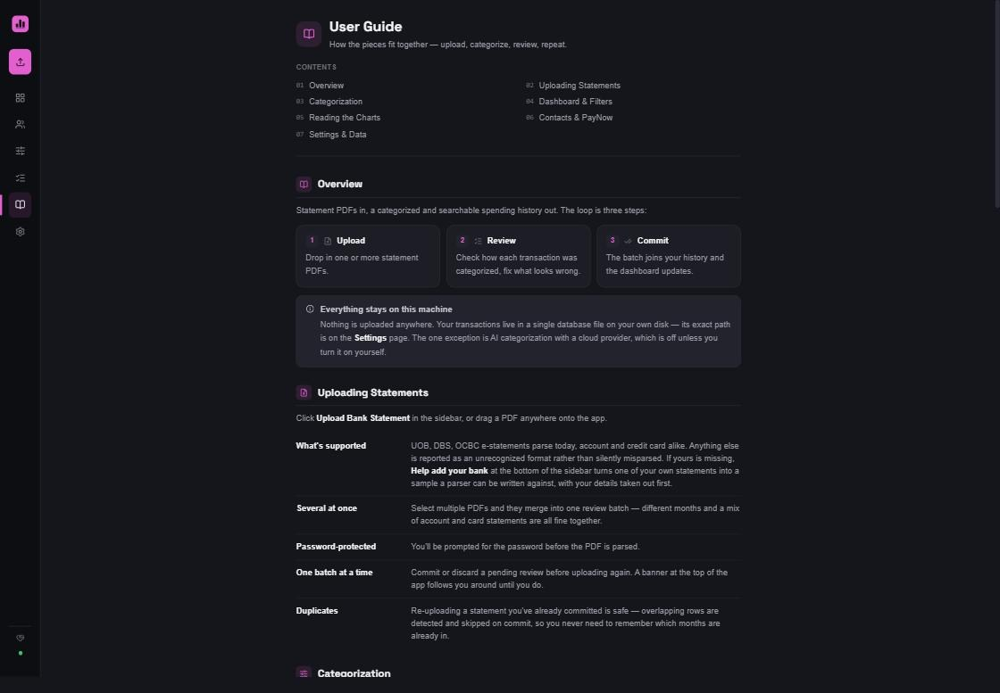

<div align="center">


# SpendTrack

**Turn bank statement PDFs into a spending dashboard, on your own computer, with nothing sent anywhere.**

[](LICENSE)
[](#your-data-stays-on-your-computer)
[](https://github.com/syoopie/spend-track/releases/latest)
[](backend/pyproject.toml)
[](frontend/package.json)

</div>

Give it a statement PDF from your bank. It reads every transaction, sorts them
into categories, cancels refunds against the purchases they reverse, and shows
you where your money went.


---

**Using it** &nbsp;·&nbsp; [Download](#download) &nbsp;·&nbsp; [Sample data](#or-try-the-sample-data-first) &nbsp;·&nbsp; [The routine](#the-everyday-routine) &nbsp;·&nbsp; [AI](#optional-ai-for-the-leftovers) &nbsp;·&nbsp; [FAQ](#faq)

**Working on it** &nbsp;·&nbsp; [Contributing](#contributing) &nbsp;·&nbsp; [Adding a bank](docs/adding-a-bank.md) &nbsp;·&nbsp; [Running from source](docs/development.md)

## Your data stays on your computer

No account, no login, nothing uploaded. Your transactions live in one file on
your own disk. The app reads PDFs you already have and never contacts your bank.
The one exception is the optional [AI feature](#optional-ai-for-the-leftovers),
off until you switch it on.



## What it does

| | |
|---|---|
| **Reads statement PDFs** | Bank and credit card, password-protected included. Drop in one or a year's worth at once. An unrecognized file says so instead of guessing. |
| **Categorizes automatically** | From rules you can see and edit, plus a built-in merchant list. Your own rules always win. |
| **Shows you everything first** | Each upload lands in a review screen, with anything uncertain flagged for you to decide, before it touches your history. |
| **Doesn't double-count** | The same statement uploaded twice is skipped. A card bill paid from a linked account is not counted on top of the purchases. |
| **Nets off refunds** | Against the purchase they reverse, matched on merchant and amount so unrelated transactions are not paired. |
| **Names who you pay** | Save a PayNow number or UEN once; later transfers to that person label and categorize themselves. |
| **Charts the picture** | Money in and out, spending by category, month-on-month pace, top merchants, most-paid contacts. All filterable by date and account. |
| **Exports in one click** | **Settings → Download Backup** gives a zip that opens in any SQLite browser. |

Banks that parse today: **UOB**, **DBS**/**POSB**, **OCBC**. Any other bank is
[one parser away](docs/adding-a-bank.md), and the only real blocker is a
statement to build it against.

## Download

No installers, no accounts, no command line. Grab the file for your computer
from the [latest release](https://github.com/syoopie/spend-track/releases/latest),
open it, and the app appears in your browser.

| Your computer | Download | How to open it |
|---|---|---|
| **Windows** | `SpendTrack-windows-x86_64.exe` | Double-click it. Windows warns that the publisher is unknown. Click **More info** then **Run anyway**. |
| **Mac** (Apple silicon) | `SpendTrack-macos-arm64.zip` | Unzip, then **right-click** the app, **Open**, **Open**. Double-clicking the first time gives a "cannot be opened" message; right-click then Open gets past it. |
| **Mac** (Intel) | `SpendTrack-macos-x86_64.zip` | Same as above. Not sure which Mac you have? Apple menu, **About This Mac**: "Apple M1/M2/…" is Apple silicon, "Intel" is this one. |
| **Linux** | `SpendTrack-linux-x86_64` | `chmod +x SpendTrack-linux-x86_64` once, then run it. |

A small window opens showing where your data is stored and the address the app
is running at, and your browser opens on the dashboard. **Closing that window
closes the app.** Your data is saved as you go.

On startup the app asks GitHub once whether there is a newer release and shows a
banner if so. That is an anonymous request to the same public releases page
linked above, with no account, no identifier, and nothing about your
transactions. The current version and this explanation are in **Settings →
About**.

<details>
<summary>Why does my computer warn me about it?</summary>

Both warnings mean the same thing: the download is not signed with a paid
developer certificate (Apple charges $99/year, Microsoft rather more). Nothing
about the app changes if you get past the warning, but you should not take that
on faith from the person who wrote it. Everything here is source code you can
read, and the download is built in the open by
[this GitHub Actions workflow](.github/workflows/desktop-build.yml), from the
exact commit each release names. If you would rather not run an unsigned binary
at all, [run it from source](docs/development.md) instead.

</details>

### Or try the sample data first

You do not need real statements to look around. `PDF Examples (Sanitized)/`
holds a fictional customer's: a year of UOB account and card statements plus
smaller DBS and OCBC sets, around 300 transactions, the same data behind every
screenshot here. Two of the DBS files are real statements run through the
sanitizer, so a live layout is in the mix. Select the folder, upload it in one
go, and **Settings** clears it out afterwards.

## The everyday routine

1. **Upload** one or more statement PDFs. Button in the sidebar, or drag them onto the window.
2. **Review** how each transaction was categorized, and fix anything that looks off.
3. **Commit.** The transactions join your history.
4. **Explore** the dashboard, filtered by whatever date range and account you care about.

The review screen is where the work happens. Everything the parser extracted is
shown before it is saved, with the uncertain rows pulled to the top, each
editable in place.



Open any row to see why it was categorized that way and change it: the display
name, the category, or save the counterparty as a contact.



The app also has a full **User Guide** in the sidebar that walks through each
screen.



## Categorization, rules and contacts

Categorization runs in a fixed order and stops at the first match: your own
rules, then a card-bill-payment check, then contact-identifier matches, then the
built-in merchant list, then a fallback that flags the transaction for review
rather than guessing.

| Rules, your own logic, top to bottom | Default Rules, the built-in merchant list, read-only |
|---|---|
|  |  |

**Contacts** map a PayNow identifier (phone, UEN, or account number) to a name
and a default category, so transfers to people you pay regularly categorize
themselves instead of sitting in "needs review".


## Optional: AI for the leftovers

**Off by default.** Turn it on under **Settings** and the transactions the rules
could not place get sent to an AI model, which suggests a category, a tidy
merchant name, and a rule to save. The suggestions land pre-filled in the review
screen for you to accept, edit, or reject. Nothing is applied on its own. Close
the review screen and they wait for you. An unreachable model shows a warning
instead of hanging the upload; a slow pass gets a **Terminate** button after 15
seconds.

Three model choices:

- **Local (Ollama)**, the default, and the only one where nothing leaves your computer.
- **OpenAI-compatible**: OpenAI, OpenRouter, Groq, together.ai, anything speaking that format.
- **Anthropic (Claude)**.

The last two send your descriptions and amounts to that company. Settings will
not save either until you tick a box confirming you understand, and any API key
you enter is kept in a local file and never shown back in full.

## FAQ

<details>
<summary><b>How do I back up or move my data?</b></summary>

**Settings → Download Backup** gives a `.zip` with your database, settings, and a
note on restoring. On the other computer, start the app once to create its
folder, quit, and copy the two files in. Your AI key is left out on purpose;
re-enter it after restoring.

</details>

<details>
<summary><b>Where is my data kept?</b></summary>

One SQLite file at `~/.spendtrack/data.db`; **Settings** shows the path.
**Settings → Change Database Path** moves it. Point it at a Dropbox or OneDrive
folder for continuous backups. An install from before the rename keeps its old
`~/.sg-expenditure-tracker` folder.

</details>

<details>
<summary><b>Does it need my bank login?</b></summary>

No. It reads statement PDFs you downloaded yourself and never connects to your
bank.

</details>

<details>
<summary><b>My statement won't upload.</b></summary>

Use the e-statement PDF from the bank, not a scan or a photo. The app reads the
text inside the file. Check the bank parses today under **Settings → Region**. A
"did not reconcile" message is the parser refusing figures it cannot check
against the statement's own totals;
[please report it](https://github.com/syoopie/spend-track/issues/new?template=bank-support.yml).

</details>

<details>
<summary><b>My browser didn't open.</b></summary>

The app window shows its address (`http://127.0.0.1:8123` by default). Open that
yourself.

</details>

<details>
<summary><b>I want to start over.</b></summary>

Settings deletes your transactions, rules, or contacts, individually or all at
once.

</details>

## Contributing

**A bank becomes supported the moment there is a statement to build a parser
against.** That is the whole blocker. Everything downstream of a parser is
bank-agnostic, so a new bank is one folder under `backend/src/app/parsing/` and
one line in a list.

The hard part is the sample. A real statement carries your name, address and
account number, no bank publishes a specimen, and the "statement template" sites
a search turns up are forgery tools. So the app has a page for it, **Help add
your bank** at the bottom of the sidebar: it rebuilds your statement into a
shareable one that keeps the layout and figures and drops everything
identifying, shows you the result before you touch it, and hands you a download
and a link to the issue form. Nothing is uploaded.

- **Add your bank**: [open a request](https://github.com/syoopie/spend-track/issues/new?template=bank-support.yml), or just run the parsers against your own files locally and report what breaks. Full detail in **[docs/adding-a-bank.md](docs/adding-a-bank.md)**.
- **Merchant rules** need no statement at all. **Default Rules → Suggest a merchant** in the app, or [the merchant-rules template](https://github.com/syoopie/spend-track/issues/new?template=merchant-rules.yml).
- **A new country** is a second `CountryProfile` in `backend/src/app/localization.py`: currency, transfer scheme, contact-identifier hint, and which parsers belong to it.

Never attach a real statement to an issue. Use the sanitizer.

## Development

Prerequisites are [uv](https://docs.astral.sh/uv/) and
[Node.js](https://nodejs.org/) 18+. Then:

```bash
git clone https://github.com/syoopie/spend-track.git
cd spend-track
./scripts/start.sh        # or scripts\start.bat on Windows
```

Running the two servers by hand, building the desktop executable, the test
suite, the stack and the project layout are all in
**[docs/development.md](docs/development.md)**. The non-obvious implementation
decisions and their rationale are in **[CLAUDE.md](CLAUDE.md)**.
